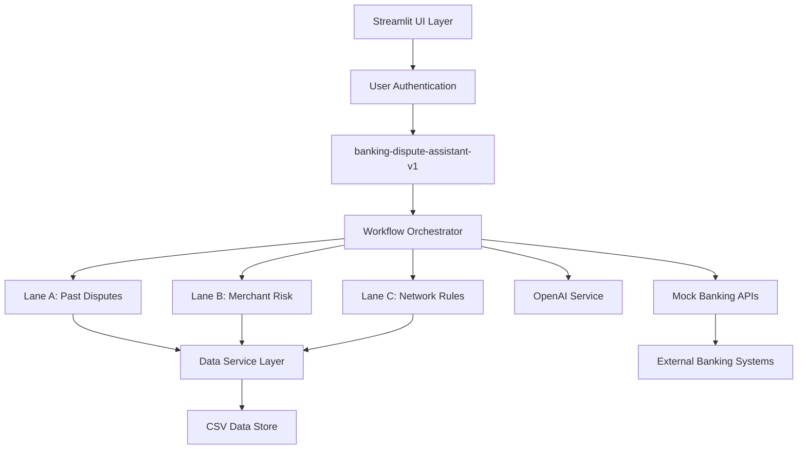
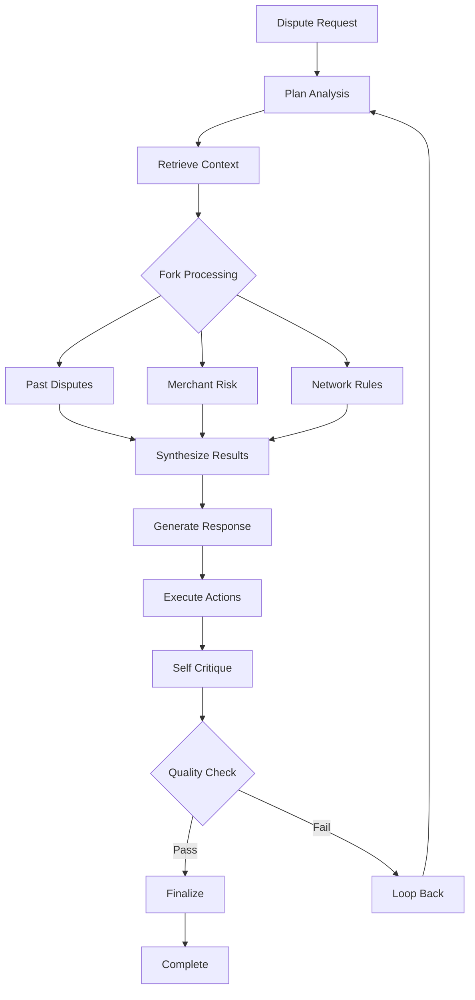

# 🏗️ banking-dispute-assistant-v1 - System Architecture

## Overview

The banking-dispute-assistant-v1 is designed as a modern, agentic AI system that demonstrates sophisticated workflow orchestration patterns. The architecture follows clean separation of concerns, async processing capabilities, and observability-first design principles.

## High-Level Architecture



## Component Architecture

### 1. Presentation Layer

**Streamlit UI (`streamlit_app.py`)**
- Apple-inspired clean interface design
- Real-time progress tracking with WebSocket-like updates
- User authentication and session management
- Responsive layout with mobile considerations

**Key Features:**
- User selection dropdown with department tracking
- Session ID generation for audit trails
- Real-time status updates during processing
- Interactive dispute form with validation

### 2. Agent Layer

**banking-dispute-assistant-v1 (`src/agents/intelligent_dispute_agent.py`)**
- Core agentic workflow implementation
- Async parallel lane processing
- Self-critique and quality assessment
- Comprehensive error handling and fallback strategies

**Workflow Steps:**
1. **Plan** - Strategy determination and context gathering
2. **Retrieve** - Transaction and policy data collection
3. **Fork** - Parallel analysis lane execution
4. **Synthesize** - Multi-lane result consolidation
5. **Generate** - Customer response and documentation creation
6. **Act** - API calls for dispute filing and credit issuance
7. **Critique** - Self-assessment and quality control
8. **Finalize** - Completion with potential loop-back

### 3. Service Layer

**Data Service (`src/services/data_service.py`)**
- Centralized data access and querying
- CSV-based data store with pandas integration
- Caching and performance optimization
- Data validation and sanitization

**OpenAI Service (`src/services/openai_service.py`)**
- GPT-4o Mini integration with function calling
- Context-aware prompt engineering
- Safe JSON serialization for complex objects
- Retry logic and error handling

**Mock API Service (`src/services/mock_api_service.py`)**
- Realistic banking system simulation
- Async processing with configurable delays
- Response validation and error scenarios
- Audit trail generation

### 4. Data Layer

**Models (`src/models/__init__.py`)**
- Pydantic v2 data models with validation
- Enum-based categorical data
- JSON serialization with datetime handling
- Type safety and runtime validation

**Data Store Structure:**
```
data/
├── users.csv           # User authentication data
├── transactions.csv    # Banking transaction records
├── past_disputes.csv   # Historical dispute cases
├── merchant_risk.csv   # Merchant risk profiles
├── network_rules.csv   # Payment network compliance rules
└── dispute_policies.csv # Bank dispute policies
```

## Agentic Workflow Pattern

### Multi-Lane Analysis Architecture

The system implements a sophisticated parallel processing pattern:

```python
# Parallel lane execution
lanes = [
    self._analyze_past_disputes(dispute_request),
    self._analyze_merchant_risk(dispute_request), 
    self._analyze_network_rules(dispute_request)
]

# Async execution with timeout handling
lane_results = await asyncio.gather(*lanes, return_exceptions=True)
```

**Lane A: Past Disputes Analysis**
- Historical pattern recognition
- Similar case outcome analysis
- Customer dispute history review
- Fraud pattern detection

**Lane B: Merchant Risk Assessment**
- Risk score evaluation
- Transaction pattern analysis
- Merchant reputation scoring
- Chargeback ratio assessment

**Lane C: Network Rules Compliance**
- Visa/Mastercard rule validation
- Chargeback reason code mapping
- Timeframe compliance checking
- Documentation requirement validation

### Decision Making Flow



## Data Flow Architecture

### Request Processing Pipeline

1. **Input Validation**
   - User authentication verification
   - Form data sanitization
   - Business rule validation

2. **Context Enrichment**
   - Transaction data retrieval
   - Policy data loading
   - Historical data correlation

3. **Parallel Analysis**
   - Concurrent lane execution
   - Independent reasoning chains
   - Confidence scoring

4. **Result Synthesis**
   - Multi-lane result merging
   - Conflict resolution
   - Final decision logic

5. **Action Execution**
   - API call orchestration
   - Error handling and retries
   - Audit trail generation

## Technology Stack

### Core Technologies
- **Python 3.11+**: Primary runtime environment
- **Pydantic v2**: Data validation and serialization
- **OpenAI GPT-4o Mini**: AI reasoning engine
- **Streamlit**: Web interface framework
- **Pandas**: Data manipulation and analysis
- **AsyncIO**: Concurrent processing

### Development Tools
- **Docker**: Containerization and deployment
- **Git**: Version control
- **Environment Variables**: Configuration management
- **CSV Files**: Mock data storage

## Security Architecture

### Data Protection
- Environment-based API key management
- Input sanitization and validation
- No real financial data storage
- Session-based user tracking

### Authentication Flow
```python
# User selection and session management
user_authenticated = render_user_selection()
if user_authenticated:
    session_id = generate_session_id(user_id)
    # Process dispute with audit trail
```

### Privacy Considerations
- All data is synthetic/mock
- No PII storage in logs
- Session isolation
- Configurable data retention

## Performance Architecture

### Optimization Strategies
- **Async Processing**: Parallel lane execution
- **Caching**: Data service result caching
- **Streaming**: Real-time UI updates
- **Resource Management**: Configurable timeouts and limits

### Scalability Considerations
- Stateless service design
- External data store ready
- Microservice architecture prepared
- Cloud deployment compatible

## Observability Architecture

### Logging Strategy
```python
# Structured logging with correlation IDs
logger.info(f"Processing dispute", extra={
    "user_id": user_id,
    "session_id": session_id,
    "dispute_id": dispute_id,
    "step": "synthesis"
})
```

### Metrics Collection
- Processing time tracking
- Confidence score distribution
- Success/failure rates
- User interaction patterns

### Future Monitoring Integration
- OpenTelemetry tracing readiness
- Prometheus metrics endpoints
- Health check implementations
- Performance dashboard hooks

## Deployment Architecture

### Local Development
```bash
# Direct execution
streamlit run streamlit_app.py

# Development with auto-reload
streamlit run streamlit_app.py --server.runOnSave true
```

### Docker Deployment
```dockerfile
FROM python:3.11-slim
COPY requirements.txt .
RUN pip install -r requirements.txt
COPY . .
EXPOSE 8501
CMD ["streamlit", "run", "streamlit_app.py"]
```

### Production Considerations
- Load balancer integration
- Database migration from CSV
- Secret management
- Monitoring and alerting
- Backup and recovery

## Extension Points

### AI Model Integration
- Multiple LLM provider support
- Custom model fine-tuning
- Embedding-based similarity search
- Vector database integration

### Banking System Integration
- Real API connectors
- Message queue integration
- Event-driven architecture
- Webhook support

### Advanced Features
- Machine learning pipeline
- Real-time fraud detection
- Compliance automation
- Regulatory reporting

This architecture provides a solid foundation for educational exploration of agentic AI systems while remaining extensible for production scenarios.